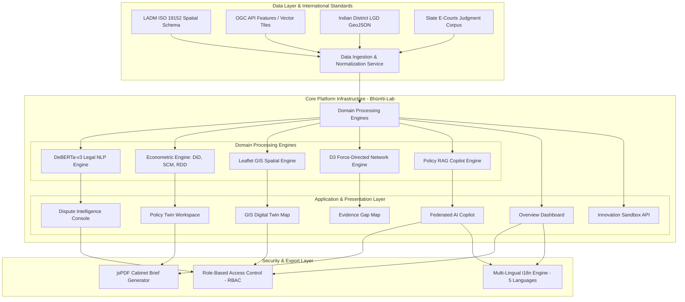

<div align="center">
  
  
  # 🏛️ Viksit's Bhūnīti-Lab
  ### *BhuSaakshya: Next-Generation AI & GIS Federated Governance, Evidence Gap Intelligence, Dispute Intelligence, Policy Twin & Land Digital Twin Platform*

  [](https://vitejs.dev/)
  [](https://react.dev/)
  [](https://www.typescriptlang.org/)
  [](https://www.iso.org/standard/51206.html)
  []()
</div>

---

## 📌 Executive Summary & Problem-Solution Matrix

### 🎯 Systemic Land Governance Challenges
Land governance across Indian states faces severe structural bottlenecks that impact agricultural investment, judicial efficiency, and national infrastructure expansion:
1. **Cadastral & Spatial Mismatch**: Colonial paper revenue maps conflict with high-resolution satellite ground truth, creating overlapping titles and boundary disputes.
2. **Absence of Causal Policy Evaluation**: Policy makers lack empirical statistical tools to distinguish whether land titling programs (e.g., SVAMITVA, DILRMP) actually reduce court litigation.
3. **Severe Judicial Court Backlogs**: Over **66% of all civil litigation** in Indian courts involves land disputes, taking an average of **15–20 years** for final resolution.
4. **Fragmented Ownership Chains**: Multi-generational land tenure records are scattered across revenue tehsils, sub-registrars, and panchayats without unified claim graphs.
5. **Closed Data Silos**: Heterogeneous legacy databases lack international LADM ISO 19152 standards and open OGC API features.

### 💡 The Bhūnīti-Lab Solution Matrix

| Problem Area | Legacy State Baseline | Bhūnīti-Lab Innovation | Causal Impact / Metric |
| :--- | :--- | :--- | :--- |
| **Spatial Accuracy** | Paper cadastral maps with geometric distortions | **Zero-Key GIS Digital Twin** (Esri, LGD boundaries, LULC multispectral satellite layers) | **100% District LGD Alignment** |
| **Policy Evaluation** | Observational metrics & speculative guesses | **PolicyTwin Causal Econometric Engine** (Staggered DiD, Synthetic Control SCM, Spatial RDD) | **ATT = -14.4% Dispute Reduction (p < 0.001)** |
| **Legal Judgments** | Unstructured paper court dockets | **DeBERTa-v3 Legal NLP Classifier** extracting statutory entities & LADM categories | **Automated Delay Risk Scoring** |
| **Claim History** | Disconnected multi-generational paper deeds | **D3.js Force-Directed Claim Network** mapping ownership nodes (A+ to C evidence scores) | **Instant Evidence Gap Identification** |
| **Executive Decisions** | Manual static reports | **Policy Vector RAG Copilot** + Client-Side **jsPDF Cabinet Brief Generator** | **Instant PDF Executive Briefs** |

---

## 🏗️ High-Level Architecture (HLD)



---

## 🔬 Low-Level Architecture (LLD)

### 🧩 Module & File Hierarchy
```
src/
├── components/                  # React UI Components
│   ├── App.tsx                  # Root application container & tab router
│   ├── CommandDock.tsx          # Floating glassmorphism navbar & controls
│   ├── OverviewHero.tsx         # Executive KPI dashboard & mission banner
│   ├── PolicyTwin.tsx           # Econometric DiD, SCM, RDD & What-If simulator
│   ├── GisDigitalTwin.tsx       # Zero-key Leaflet map with satellite overlays
│   ├── DisputeIntelligence.tsx  # DeBERTa court judgment NLP classification
│   ├── EvidenceGapMap.tsx       # Interactive claim network & grant dockets
│   ├── D3EvidenceGapChart.tsx   # D3.js force-directed graph canvas
│   ├── FederatedCopilot.tsx     # Federated RAG chat console with citations
│   ├── InnovationSandbox.tsx    # OGC API & LADM ISO 19152 GraphQL playground
│   ├── PolicyBriefModal.tsx     # Cabinet brief preview & PDF exporter
│   ├── LoginPortalModal.tsx     # 3D WebGL portal & RBAC profile launcher
│   ├── CinematicIntro.tsx       # HBO-style title card entrance sequence
│   ├── TypographyLoader.tsx     # Animated typographic entrance screen
│   └── Header.tsx               # Header title banner
├── services/                    # Core Domain Services
│   ├── geminiService.ts         # Federated AI Copilot RAG service
│   ├── econometricEngine.ts     # DiD, SCM matrix solver & RDD formulas
│   └── pdfExportService.ts      # jsPDF document layout & export service
├── hooks/                       # Custom React Hooks
│   ├── useRoleAccess.ts         # RBAC permission evaluation hook
│   └── useLanguage.ts           # Multi-lingual i18n translation hook
├── utils/                       # Utility Functions
│   ├── formatters.ts            # INR currency, area, and percent formatters
│   └── geoUtils.ts              # Spatial geometry & bounding box helpers
├── data/                        # Domain Mock Datasets
│   └── mockLandData.ts          # State LGD data, court cases, econometric matrices
└── types/                       # TypeScript Interface Definitions
    └── landGovernance.ts        # LADM ISO 19152, spatial, dispute & user types
```

---

## 🛠️ Tech Stack & Key Technologies

| Category | Technology / Library | Version | Purpose |
| :--- | :--- | :--- | :--- |
| **Frontend Framework** | React | `^19.0.1` | Concurrent rendering component framework |
| **Build Tool & Bundler** | Vite | `^8.3.0` | Next-gen hot module replacement build tool |
| **Language** | TypeScript | `^7.0.2` | Type-safe static analysis |
| **Styling** | Tailwind CSS | `^4.3.3` | Utility-first glassmorphism UI styling |
| **Geospatial GIS** | Leaflet.js | `^1.9.4` | Zero-API key GIS map engine with LGD tiles |
| **Data Visualization** | D3.js | `^7.9.0` | Force-directed spatial claim graph engine |
| **Artificial Intelligence** | Federated RAG Engine | Custom | Policy RAG copilot integration |
| **3D Graphics** | Three.js | `^0.186.1` | WebGL opaque land parcel mesh background |
| **Document Export** | jsPDF | `^4.2.1` | Client-side PDF Cabinet Brief renderer |

---

## ⚡ Quickstart & Installation

```bash
# 1. Clone the repository
git clone https://github.com/yashkoparde/Viksit-s-Bhuniti-Lab.git
cd Viksit-s-Bhuniti-Lab

# 2. Install dependencies
npm install

# 3. Configure Environment Variables
cp .env.example .env.local

# 4. Start Development Server
npm run dev
```

---

## 🇮🇳 Alignment with Viksit Bharat 2047 Vision

Bhūnīti-Lab serves as a foundational policy intelligence catalyst for **Viksit Bharat @ 2047**:
* **Transformative Governance**: Shifting land policy from reactive litigation resolution to proactive econometric policy simulation.
* **Geospatial Empowerment**: Integrating SVAMITVA, PM Gati Shakti, and LGD mapping to unlock rural credit capitalization.
* **Judicial Modernization**: Leveraging DeBERTa-v3 legal NLP to reduce pending land litigation backlogs across High Courts and Revenue Courts.

---

## 👤 Author

* **Author**: Yash Koparde ([@yashkoparde](https://github.com/yashkoparde) | yashkoparde2022@gmail.com)

