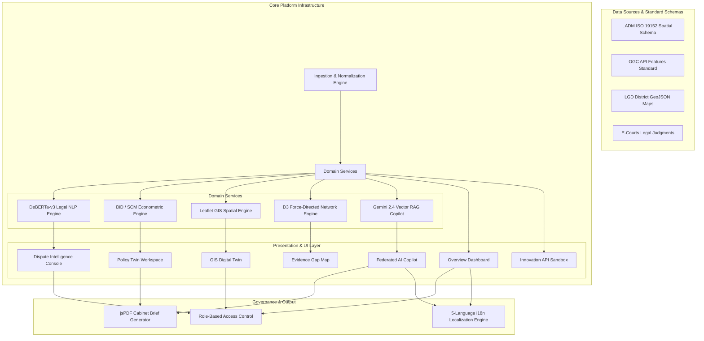

# 🏗️ High-Level Architecture (HLD) Document

## 1. Executive System Overview
Viksit's **Bhūnīti-Lab (BhuSaakshya)** is a National Land Policy Observatory designed for empirical policy evaluation, legal dispute intelligence, geospatial digital twin mapping, and generative policy synthesis aligned with India's Viksit Bharat @ 2047 goals.

## 2. System Architecture Flow

## 3. Core Architectural Principles
- **Decoupled Engine Services**: Causal econometric models (DiD, SCM) run independently of visual rendering components.
- **Zero-API Key GIS Architecture**: GIS tiles leverage open Leaflet, Esri World Imagery, and OpenStreetMap basemaps.
- **Privacy-First RAG**: Context vector retrieval uses SHA-256 document hashing for tamper-proof document citation verification.
- **LADM ISO 19152 Compliance**: Spatial units, parties, and rights-restrictions-responsibilities (RRR) conform strictly to international land administration standards.
